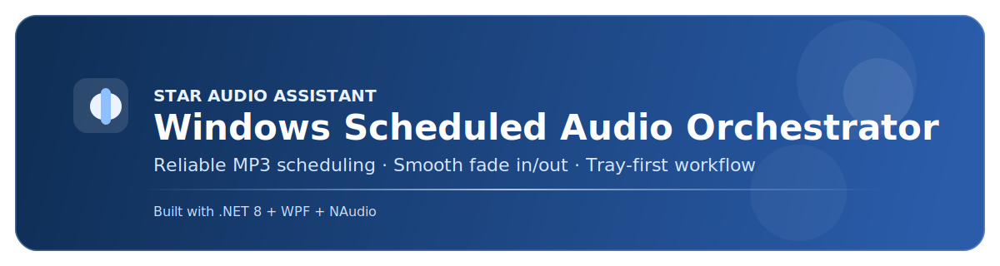
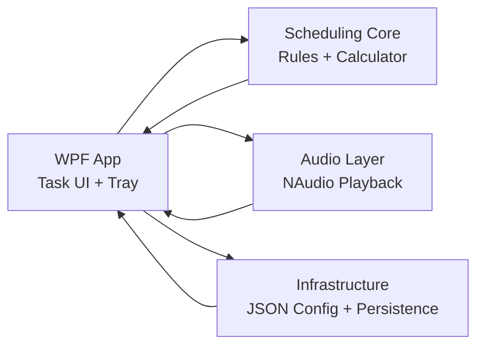

<p align="center">
  
</p>

<p align="center">
  <a href="https://github.com/seenne/starmo-audio-assistant/releases/latest">
    
  </a>
  <a href="./LICENSE">
    
  </a>
  
  
</p>

<h1 align="center">Starmo Audio Assistant · 星晨音频助手</h1>

<p align="center">
  Production-grade scheduled audio orchestration for Windows.
</p>

<p align="center">
  <a href="#中文介绍">中文</a> ·
  <a href="#english-overview">English</a> ·
  <a href="https://github.com/seenne/starmo-audio-assistant/releases/latest">Download</a> ·
  <a href="#quick-start">Quick Start</a>
</p>

## 中文介绍
`Starmo Audio Assistant（星晨音频助手）` 是一款偏工程级稳定性的 Windows 定时音频工具。  
面向“长期后台运行”的使用场景，强调可靠调度、可诊断、可维护。

### 你会得到什么
- 高可靠定时：每周循环、单次执行、跨天时间窗
- 专业播放控制：系统音频接口、淡入淡出、任务抢占
- 后台稳定运行：托盘模式、快速恢复、异常记录
- 清晰可控界面：任务详情、冲突提示、健康状态可视化
- 便携交付：免安装压缩包，开箱即用

## English Overview
`Starmo Audio Assistant` is a reliability-first Windows scheduler for audio tasks.  
It is built for long-running tray workflows where predictable timing and diagnostics matter.

### What You Get
- Robust scheduling: weekly recurring, one-time, and cross-day windows
- Professional playback: system audio path with fade-in/fade-out and preemption
- Stable background runtime: tray-first workflow with resilient state handling
- Operational visibility: conflict hints, task health checks, and error center
- Portable delivery: no-installer zip package

## Why It Feels Professional
| Dimension | Design Choice | Outcome |
|---|---|---|
| Reliability | Skip missed triggers after sleep/wake gaps | Avoids unexpected catch-up playback |
| UX Clarity | Disable irrelevant actions when no row is selected | Fewer invalid operations |
| Audio Quality | Fade transitions with preemption policy | Smooth handover between tasks |
| Operability | Error center + diagnostics export | Faster troubleshooting |
| Distribution | Scripted portable packaging + retries | Repeatable release process |

## Feature Matrix
| Capability | Status |
|---|---|
| Weekly scheduler | Ready |
| One-time scheduler | Ready |
| Cross-day time range | Ready |
| Fade in/out playback | Ready |
| Task preemption | Ready |
| Tray mode | Ready |
| Holiday skip strategy | Ready |
| Health checks & diagnostics | Ready |
| UI regression automation | Ready |

## Quick Start
Use the bundled SDK in this repository:

```powershell
$dotnet = '.\\.dotnet\\dotnet.exe'
& $dotnet --info
& $dotnet test
& $dotnet build StarAudioAssistant.sln -c Debug
& $dotnet run --project src/StarAudioAssistant.App/StarAudioAssistant.App.csproj
```

## Portable Package
Generate a brand-new timestamped zip each time:

```powershell
powershell -ExecutionPolicy Bypass -File .\scripts\pack-portable.ps1
```

Or double-click:
- `pack-portable.cmd`

Output:
- `dist\packages\StarmoAudioAssistant-portable-win-x64-<timestamp>.zip`

## Architecture


### Project Layout
- `src/StarAudioAssistant.App`: desktop shell, task editor, tray integration
- `src/StarAudioAssistant.Core`: scheduling rules and trigger calculations
- `src/StarAudioAssistant.Audio`: audio abstraction and fade playback engine
- `src/StarAudioAssistant.Infrastructure`: config storage and runtime persistence
- `tests/StarAudioAssistant.Core.Tests`: scheduling/config regression tests

## Runtime Notes
- Config path: `%AppData%\StarmoAudioAssistant\config.json`
- Supports playback while the same Windows user session stays active
- Invalid audio paths are surfaced through health checks and error center

## Search Keywords
`windows audio scheduler`, `wpf audio player`, `mp3 scheduled playback`, `naudio scheduler`, `tray audio assistant`

## License
MIT © 2026 Starmo Audio Assistant Contributors
